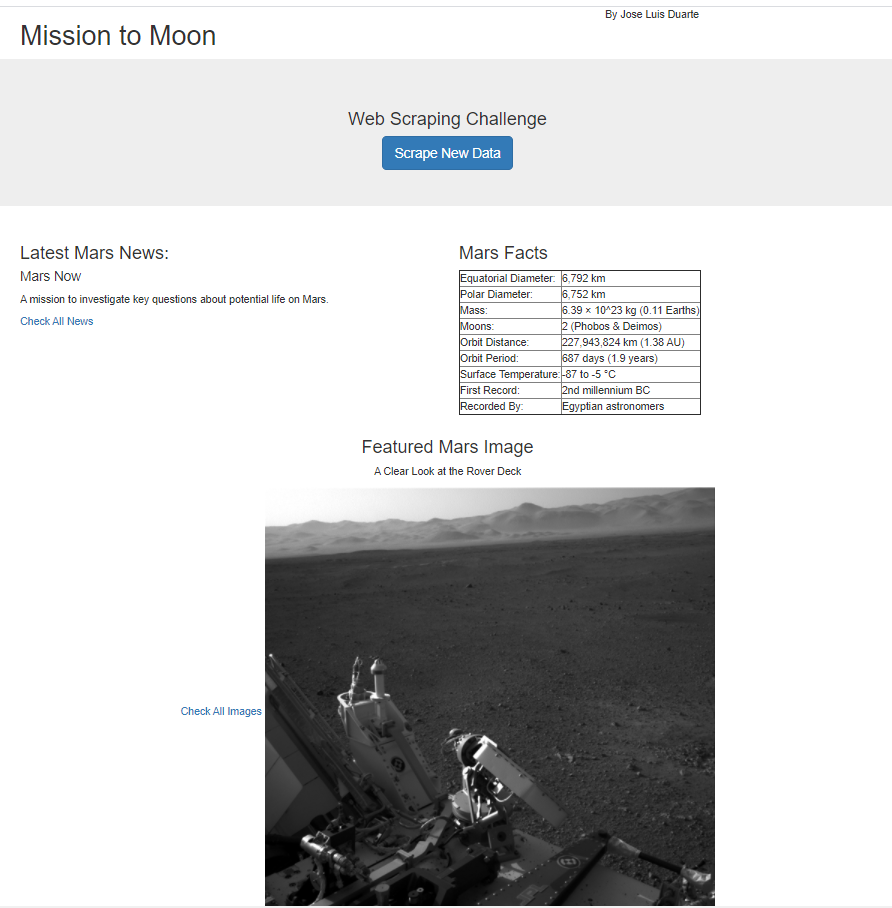
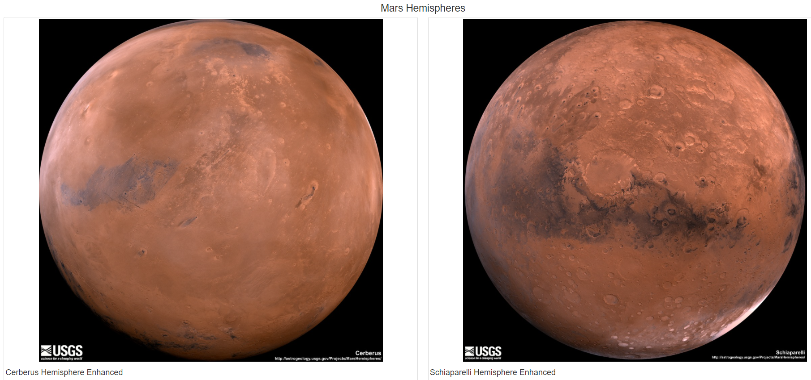
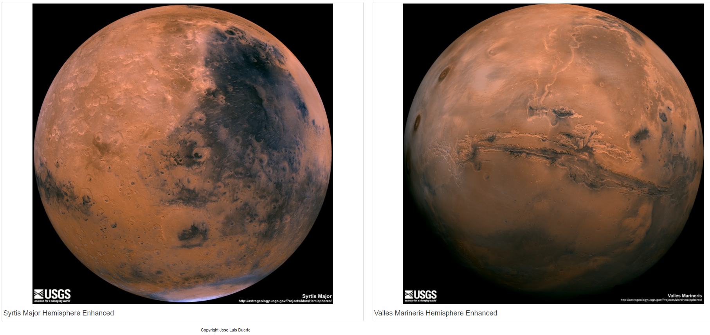

# Web Scraping Homework - Mission to Mars


In this assignment, built a web application that scrapes various websites for data related to the Mission to Mars and displays the information in a single HTML page. 


## Step 1 - Scraping


* Created a Jupyter Notebook file called `Mission_to_Mars-JLDA.ipynb` and use this to complete all of your scraping and analysis tasks. 

### NASA Mars News

```
# URL Mars News
news_url = 'https://mars.nasa.gov/news/'
browser.visit(news_url)

# Create a Beautiful Soup object
news_html = browser.html
news_soup = bs(news_html, 'html.parser')

# Extract title  and paragraph text
news_title = news_soup.find('div', class_='content_title').text
news_parag = news_soup.find('div', class_='article_teaser_body').text

# Display scrapped data 
print(f"The title found: {news_title}")
print(f"The paragraph related: {news_parag}")

# Extract title  and paragraph text
news_title = news_soup.find("div",class_="content_title").text
news_parag = news_soup.find("div", class_="rollover_description_inner").text

# Display scrapped data 
print(f"The title found: {news_title}")
print(f"The paragraph related: {news_parag}")

```

### JPL Mars Space Images - Featured Image

```
# Mars Space Images
jpl_image_url  = 'https://www.jpl.nasa.gov/spaceimages/?search=&category=Mars'
browser.visit(jpl_image_url )
jhtml = browser.html
print(jhtml)

jpl_soup = bs(jhtml,"html.parser")
print(jpl_soup)

# Get URL
image_url = jpl_soup.find('div',class_='carousel_container').article.footer.a['data-fancybox-href']
base_link = "https:"+jpl_soup.find('div', class_='jpl_logo').a['href'].rstrip('/')

#  Get Image
feature_image_url = base_link+image_url
featured_image_title = jpl_soup.find('h1', class_="media_feature_title").text.strip()

#Display scrapped data 
print(f'Featured image title found:{featured_image_title}')
print(f'Featured image url found:{feature_image_url}')

```

### Mars Weather

```
# Mars Weather
weather_url  = 'https://twitter.com/marswxreport?lang=en'
browser.visit(weather_url)
html_weather  = browser.html
print(html_weather )

# Scrap in TW
weather_soup = bs(html_weather,"html.parser")
print(weather_soup)
mars_weather = weather_soup.find("p", class_= "TweetTextSize TweetTextSize--normal js-tweet-text tweet-text")

#Display scrapped data 
print(f"mars weather :{mars_weather }")

```

### Mars Facts

```
# mars fact
#!pip install lxml
#!pip install html5lib 

#Mars Facts
facts_url = 'http://space-facts.com/mars/'
mars_data = pd.read_html(facts_url)

#Read and parse url
mars_data = pd.read_html(facts_url)

#Find Mars facts in DF
mars_df = mars_data[0]

#Assign columns
mars_df.columns = ['Description','Value']

#Set index
mars_df.set_index('Description', inplace=True)

#Convert to HTML table string
mars_df.to_html()
data = mars_df.to_dict(orient='records') 

#Display scrapped data 
mars_df

```

### Mars Hemispheres

```
# Mars Hemispheres
mhurl = 'https://astrogeology.usgs.gov/search/results?q=hemisphere+enhanced&k1=target&v1=Mars'
browser.visit(mhurl)    

mhtml = browser.html
print(mhtml)

mh_soup = bs(mhtml,"html.parser")
print(mh_soup)

results = mh_soup.find_all("div",class_='item')
hemisphere_image_urls = []

#Scrap process
for result in results:
        product_dict = {}
        titles = result.find('h3').text
        end_link = result.find("a")["href"]
        image_link = "https://astrogeology.usgs.gov/" + end_link    
        browser.visit(image_link)
        html = browser.html
        soup= bs(html, "html.parser")
        downloads = soup.find("div", class_="downloads")
        image_url = downloads.find("a")["href"]
        print(titles)
        print(image_url)
        product_dict['title']= titles
        product_dict['image_url']= image_url
        hemisphere_image_urls.append(product_dict)
        
```

- - -

## Step 2 - MongoDB and Flask Application

Used MongoDB with Flask templating to created a new HTML page that displays all of the information that was scraped from the URLs above.

Codebase for `scrape function` is [here](scrape_mars.py)

Codebase of `app` is [here](app.py)

Codebase of `Index` is [here](/templates/index3.html)

Codebase of `style` is [here](/templates/style.css)

- - -

## Images






### Copyright

Jose Luis Duarte © 2020. All Rights Reserved.
